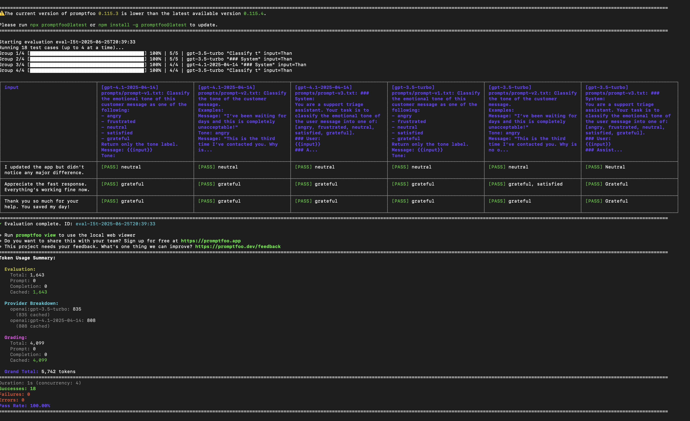
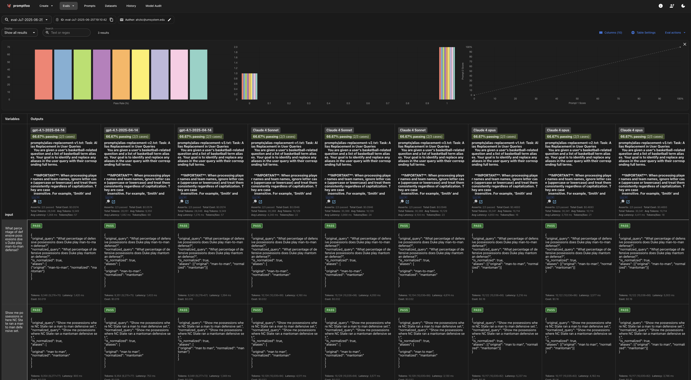

# Tone Classifier Prompt Evaluation – Promptfoo

#### Promptfoo is a framework designed to help you evaluate the performance of your LLM. Just like you write unit tests to check if individual functions in your code work correctly, Promptfoo lets you test and validate prompts to ensure your language model behaves as expected. This project shows how Promptfoo works and provides a repository to help you set it up for your own LLM workflows.

This project evaluates different prompt versions for **emotion/tone classification** in customer support messages using [Promptfoo](https://github.com/promptfoo/promptfoo). It compares how well different prompts and LLMs (e.g. GPT-4.1, GPT-3.5-turbo) can identify tones like `angry`, `frustrated`, `neutral`, `satisfied`, and `grateful`.

---

## What is this project for?

- Test and compare multiple prompt versions (`v1`, `v2`, `v3`) for **tone classification**
- Evaluate LLMs like GPT-4.1 and GPT-3.5 on how accurately they classify message tone
- Automatically validate output using `llm-rubric` assertions
- Visualize evaluation results in a web UI
- Support prompt refinement by running controlled tests

---

## ⚙️ Setup Instructions

### Create a virtual environment

Using Conda:
```bash
conda create --name promptfoo python=3.11
conda activate promptfoo
```

#### Clone the repository:

```bash
git clone https://github.com/Ahmad-Tamim-Hamad/promptfoo
```

Navigate to the directory 

```bash
cd promptfoo
```

#### Install all the packages from requirments.txt file
```bash
pip install -r requirements.txt
```

#### Set your API keys in the terminal (for one or more models). For example:

```bash
export OPENAI_API_KEY=your_model_apikey
export ANTHROPIC_API_KEY=your_model_apikey_here
```

##### Run the pipeline using:

```bash
promptfoo eval --no-cache
```

#### It will display the evaluation results after finishing.



---

#### Run the pipeline to see the visulization using:

```bash
promptfoo view
```

#### It will display the evaluation results after finishing.

